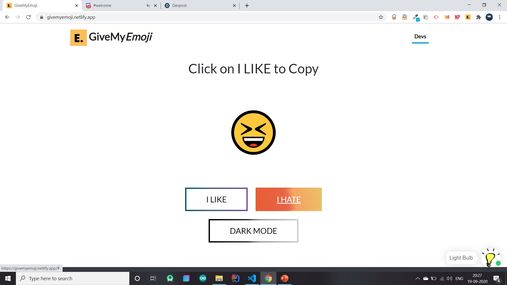
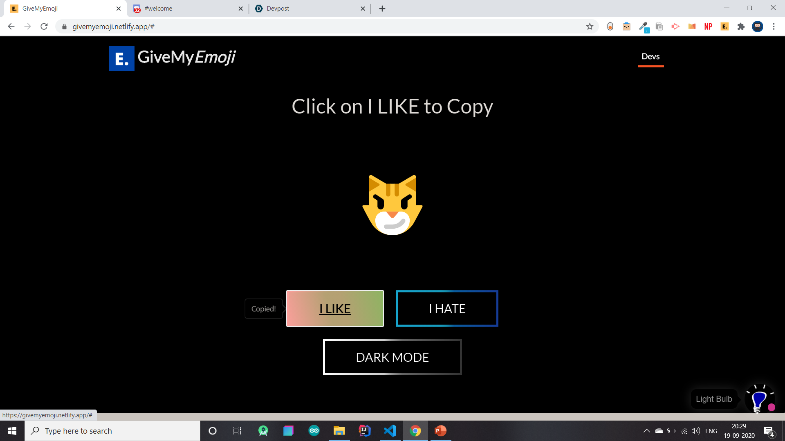
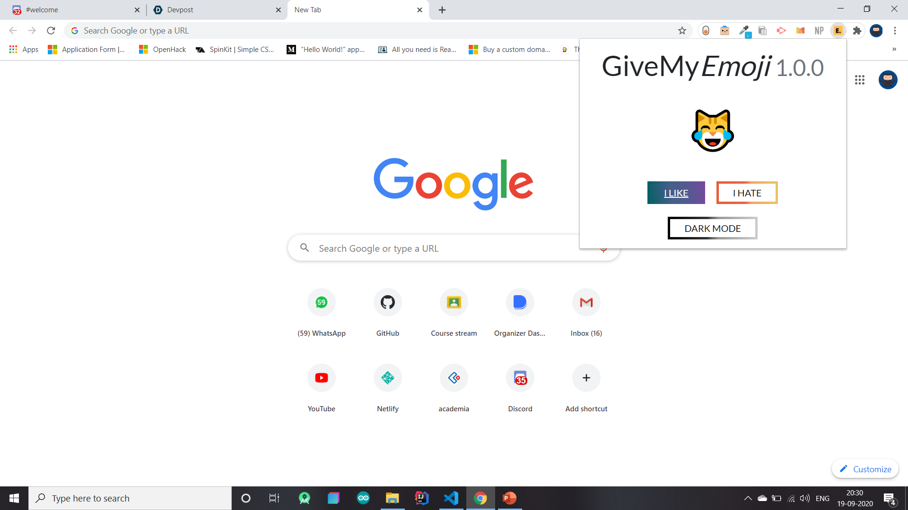
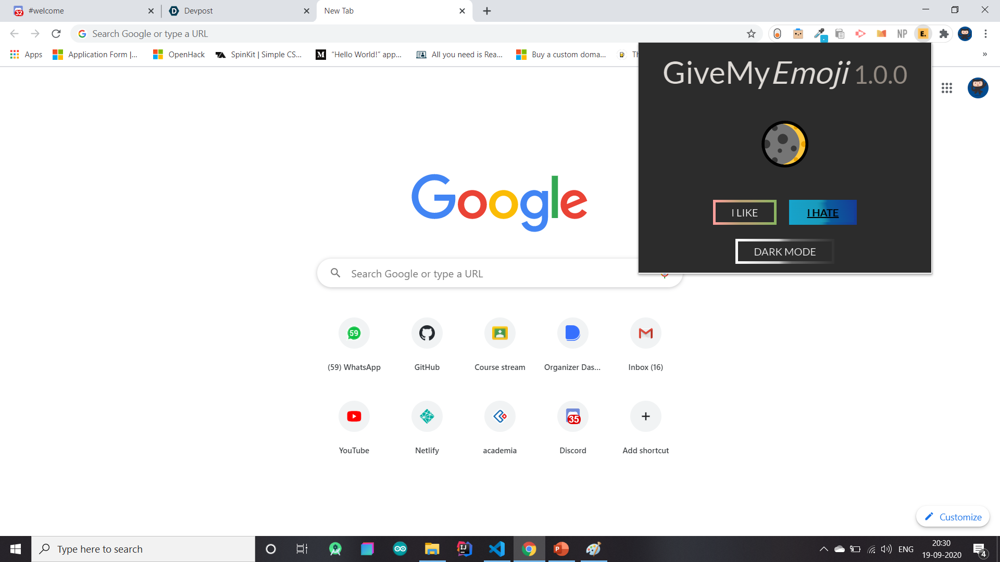
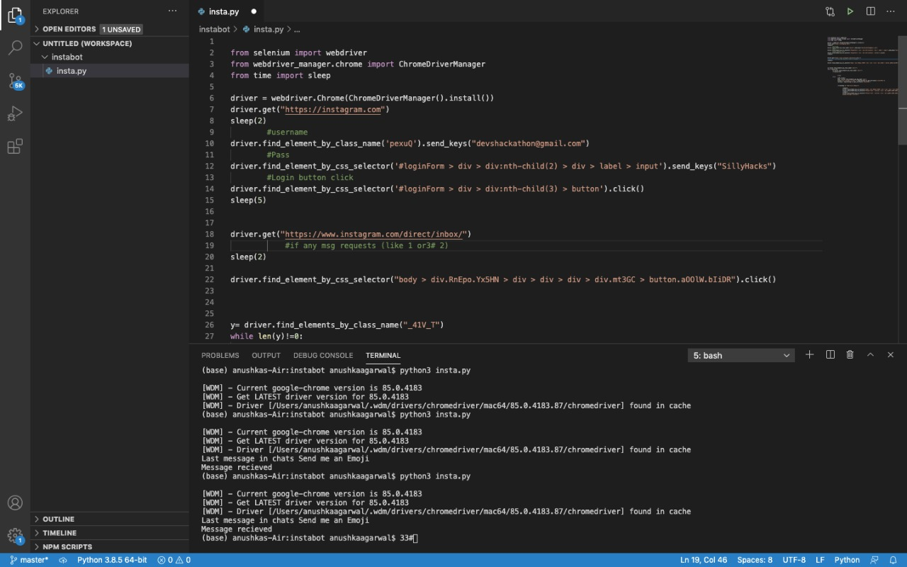
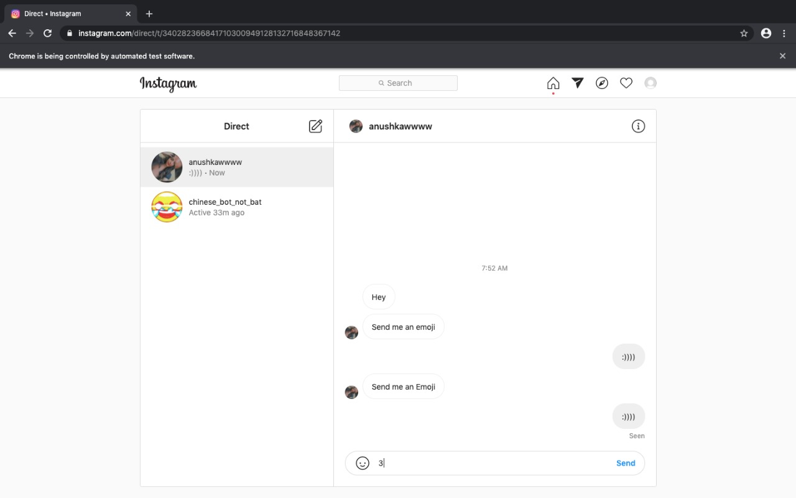

# Team codeBlooded for Silly Hacks

Official Entry of Team codeBlooded, from SRM Institute of Science and Technology, Kattankulathur, to Silly Hacks.  

 

## Links to Silly Hacks

- [Official Website](https://slillyhacks.online/)
- [MLH](https://mlh.sillyhacks.com/)
- [Code of Conduct](https://static.mlh.io/docs/mlh-code-of-conduct.pdf?fbclid=IwAR2vbP-bruJ_ZyL9D0bamJ-15OxadEtm0tv4l1EYBBkNnJ5-6XoUe0Zd2ZE)

## Track and Problem Statement 🚧

***Random Emoji Generator!***

## Background 📖

Are you confused, irritated, anxious or sad when you don't find an emoji for those *bland* conversations? We are too, and that is why we came up with GiveMy*Emoji*! The **Silliest** Hack you can think about but then at the same time, pretty **useful**! Now hover over to our Website or Chrome Extension to shuffle between hundreds of emojis to find the right one to spice up your chats! ** wink wink ** We also have a smol surprise so do watch the video!

**Give life to your boring conversations!**

## About GiveMyEmoji 🔧
### What
GiveMy*Emoji* is a collection of a **Website** and a **Chrome Extension** to help you find **THE** emoji that you need. It is developed using simple HTML, CSS, JavaScript and a lot of love. You see, no fancy words there! ***Surprise!*** We also have an Instagram Bot built with Selenium that sends you ASCII emoji in chat and an Instagram Filter built on Spark AR to throw Random Emojis!

### Why
Often we encounter situations where we are speechless, why not use **emojis** there instead? Unless you're talking to beep-bops 🤖 we guarantee you that GiveMy*Emoji* is definitely going to help you out!

### How
With a super simple **User Interface** for Boomers and Babies, in both the website and the extension you have two buttons available with a Dataset of hundreds of emojis. When you click on `I LIKE`, the emoji on the screen is automatically copied, ready to spice up your bland conversations and if you click on `I HATE`, a new emoji is spinned up in no time! **Magic!**

If we talk about the Instagram Bot and Filter, when you send a `Send me an emoji` to the bot hosted over ***@givemyemoji*** on Instagram, it sends you random ASCII emojis, automated through a Selenium Script. The Filter, built using SparkAR is pretty easy to use, like every other Instagram Filter.
  

## Installation and Execution

1. To checkout the **Website** simply head over [here](https://givemyemoji.netlify.app) or follow these steps.
   - Clone this repository.
   - Open index.html.
   - Make sure you have active Internet Connection so the Web Application functions best (Chatbot requires access to the Internet).

2. To explore our **Chrome Extension** follow these steps.
   - Clone this repository.
   - Head over to the Folder Chrome Extension and check that all files are present.
   - Type `chrome://extensions/` in a Chrome Tab. Switch on Developer Mode.
   - Click on Load Unpacked and select the Chrome Extension Folder.
   - Now check out GiveMyEmoji in an extension!

3. To experience the **Instagram Bot** go over Instagram at @GiveMyEmoji or run the Selenium Script using the following steps.
   - Clone this repository.
   - Open the folder [instabot](instabot/insta.py).
   - Install Selenium using `pip 3 install selenium`.
   - Execute [insta.py](instabot/insta.py) which is written in Selenium using `python insta.py`.

4. To see our **Instagram Filter** follow these steps.
   - Head over to SparkAR after cloning the repository.
   - Check the folder named [Instagram-Filter](Instagram%20Filter).
   - Open it with SparkAR.
   - You're good to go!

## Timeline ⏰

- Sept 18: Research and Initial Documentation, Commencement of Development
- Sept 19: Development of Website and Chrome Extension Finished
- Sept 20: Development of Instagram Filter and Bot Finished

## Technology Principles Implemented 💡

1. Mobile First
2. Minimalist Design
3. Reusable
4. Well Documented
5. Open Source

## Technology Stack 💻

Keeping it simple, no big words!
- HTML
- CSS
- JavaScript
- Bootstrap
- Selenium
- SparkAR
- Netlify
- Collect.chat
- GitHub Actions

## Nominations for Category/Sponsor Prizes 🤝

 - **Hacking with the GitHub Student Developer Pack**
   - Used the following tools and services from the GitHub Student Developer Pack in our hack:
     - Bootstrap Studio
     - Canva
     - GitHub
     - IconScout
     - Atom
     - GitHub Desktop
     - ImgBot

 - **Best Beginner Hackers - MLH**
 - **Best Jugaad - MLH**
    - Instead of using some complex Database relation, we simply used a JavaScript Function to import emojis, fed in the form of an Array! Jugaaaad 💯!
 - **Silliest of All (2)**
    - Our Creativity as a team was out of the box! Keeping our CrAzY Radar on, we combined breathtaking UI/UX Fundamentals with the silliest idea to give our imagination a face in the form of GiveMy*Emoji*.

## Collaborators 🤖

No beep-bops, only **devs** 💖.
- [Aaishika S Bhattacharya](https://www.github.com/aaishikasb) - Team Lead
- [Anushka Agarwal](https://www.github.com/anushka17agarwal)
- [Gyanesh Samanta](https://www.github.com/Gyanesh-Samanta-123)
- [Souharda Biswas](https://www.github.com/TheSouharda)

